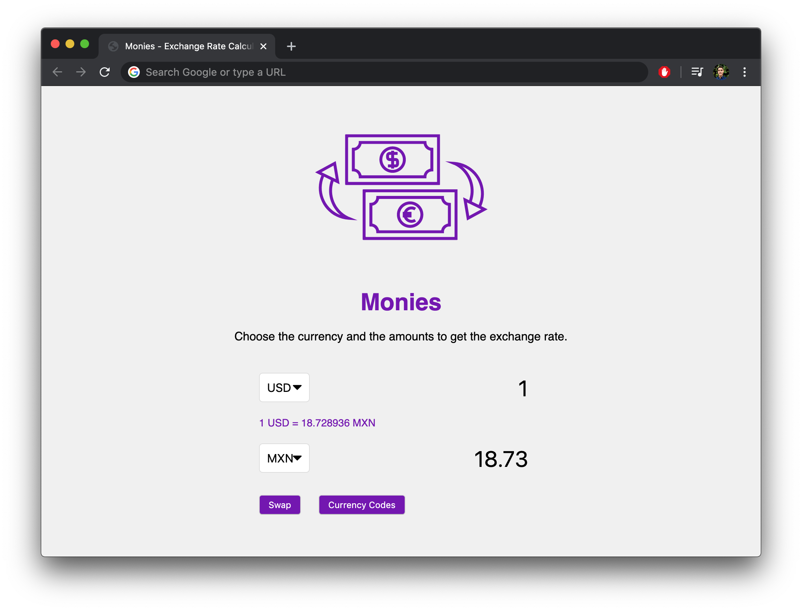

# Monies - 
An exchange rate calculator by mrivasperez.
Live demo: <https://mrivasperez.github.io/Monies/>

## Screenshot

## About
Monies is an exchange rate calculator. It has capacity to convert 50 currencies used in 70 countries! I built it using HTML, CSS, and Vanilla JS.

## Usage
You can use the app by visiting <https://mrivasperez.github.io/Monies/>. Alternately, to run this app locally, download the repository as a zip file. Create a new folder in your system then drag and drop the contents of the zip file to that new folder. Double click "index.html" to open the page.

## Guide
### About the user interface
When you first visit or open Monies, you will see seen the conversion from 1 US to MXN.
### How to change amounts
To change amounts click on the number at the top and type in a new number.
### How to change currecny
To change currency, click on the current currency that you wish to change and select a new one from the drop down menu.
### What do the country codes mean?
The country codes used in this project are the ISO 4217 Three Letter Currency Codes. To view the country codes and their currency name and country, click on the "Currency Codes" button. This will display a table with all country codes information.

## Credits
- Current icon created by Viral faislovers from the Noune Project <https://thenounproject.com/viral.faisalovers/>
- I used the ExchangeRate-API for all exchange rate info and currency codes. <https://www.exchangerate-api.com/>
